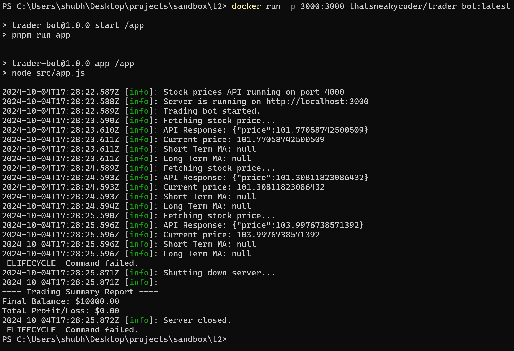
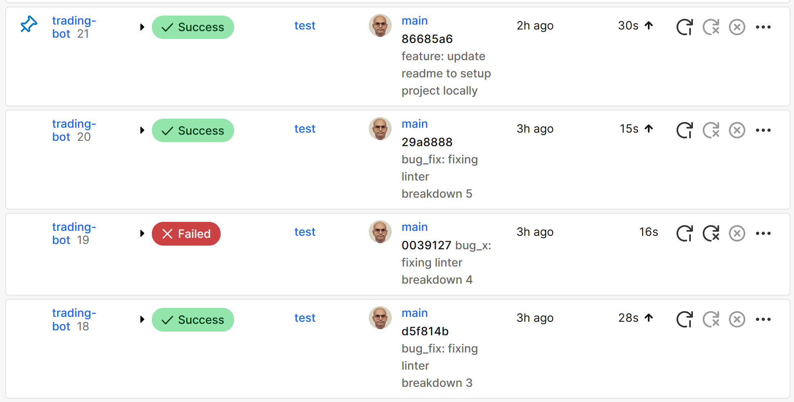

# Trader Bot

Trader Bot is a stock trading simulation tool built in Node.js. It automates the buying and selling of stocks based on real-time data and trading strategies, providing a comprehensive report on performance.

### Key Features:
- **Automated Trading**: Executes trades using moving average strategy.
- **Real-time Stock Price Simulation**: Generates random price changes for stock market simulation.
- **Trading Report**: Generates detailed summaries of trades.

### Target Users:
- Traders and developers interested in market simulations.

## Tech Stack:
- **Backend**: Node.js, Express.js
- **Logging**: Winston
- **Testing**: Jest, Supertest
- **Libraries**: Axios, dotenv, ESLint, JSDoc
- **Dependency Management**: pnpm
- **Development Tools**: Babel
- **Containerization**: Docker


# Installation

Follow these steps to set up Trader Bot locally. This guide assumes no prior installations of required software.

## Prerequisites

Ensure you have the following software installed:

1. **Node.js and npm**:
   - Download and install Node.js from [nodejs.org](https://nodejs.org/).
   - Verify the installation by running `node -v` and `npm -v` in your terminal.

2. **pnpm** (Package Manager):
   - Install pnpm globally using npm:
     ```sh
     npm install -g pnpm
     ```

3. **Docker** (optional, for containerization):
   - Download and install Docker from [docker.com](https://www.docker.com/).
   - Verify the installation by running `docker -v` in your terminal.

## Steps

1. **Clone the Repository**:
   ```sh
   git https://github.com/ThatSneakyCoder/trading-bot.git
   cd trader-bot
   ```

2. **Install Dependencies**:
   ```
   pnpm install
   ```

3. **Set Up Environment Variables**:
   - Create a .env file in the project root and add your environment variables:
      ```
      PORT=3000
      ```

4. **Run the Application**:
      ```
      pnpm start
      ```

4. **Run Tests (optional)**:
      ```
      pnpm test
      ```

## Additional Steps (For Docker Users)

Follow these steps to pull the Docker image of Trader Bot and run the application locally.

## Prerequisites

Ensure you have Docker installed on your system:
- Download and install Docker from [docker.com](https://www.docker.com/).
- Verify the installation by running `docker -v` in your terminal.

## Steps

1. **Pull the Docker Image**

   Open your terminal and run the following command to pull the Trader Bot image from Docker Hub:
   ```sh
   docker pull thatsneakycoder/trader-bot:latest
   ```

2. **Run the Docker Container**

   Run the container in foreground mode so you can see the console outputs directly in your terminal:
   ```sh
   docker run -p 3000:3000 thatsneakycoder/trader-bot:latest
   ```
3. Verify
   Once the container is running, you should see the logs output in your terminal. The application will start running on port 3000.
   
## Application Images

1. **Start**
   

2. **Testing**
   

3. **Linter** \
   Below image shows no src code violations.
   

4. **Docker Compose**
   

5. **CircleCI builds**
   

## Further possible implementations (could not be implemented due to time shortage of this assignment)

### 1. Hosting the Application on AWS
   This application can be deployed on an AWS EC2 instance, such as t2.micro. SSH can be used to access and manage the instance effectively, ensuring seamless application use.

### 2. Enhancing Data Intensity through Distributed Computing
   Discussions can focus on transforming the trading bot into a data-intensive application using a distributed computing setup. Converting the application to a microservices architecture can allow for the integration of numerous advanced features.

### 3. Implementing Scalability and Optimization Measures
   To accommodate a large user base, features such as an API rate limiter and caching mechanisms can be implemented. These measures will help manage high traffic efficiently and enhance overall performance.